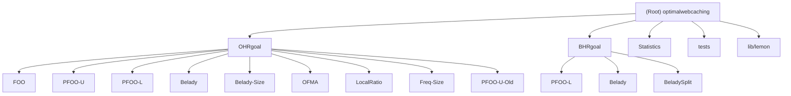

# Optimal Web Caching - AI Context

## Change Log

### 2026-01-06 21:15:22
- Initial AI context generation
- Performed repository census identifying 13 algorithm modules
- Created module-level documentation for OHRgoal and BHRgoal algorithms
- Established build, test, and development standards

---

## Project Vision

This repository provides tools for calculating **optimal caching policies** and **hit ratios** for request traces with **variable object sizes**. It addresses a fundamental limitation of Belady's algorithm: while optimal for fixed-size objects, it is suboptimal when cached objects vary in size—a common scenario in real-world systems like memcached, CDN caches (Varnish), and storage systems (Ceph).

The project implements advanced algorithms including:
- **FOO (Flow Offline Optimum)**: Asymptotically exact derivation of optimal caching (OPT)
- **PFOO (Practical FOO)**: Fast calculation of upper and lower bounds on OPT
- Various OPT approximations for both Object Hit Ratio (OHR) and Byte Hit Ratio (BHR) optimization

This is a research prototype supporting the [SIGMETRICS 2018 paper](https://www.cs.cmu.edu/~dberger1/pdf/2018PracticalBound_SIGMETRICS.pdf): *"Practical Bounds on Optimal Caching with Variable Object Sizes"*.

---

## Architecture Overview

The repository is organized as a collection of **standalone algorithm implementations**, each in its own directory with a self-contained build system. All algorithms share common trace parsing infrastructure but implement different optimization strategies.

### Design Principles

1. **Modularity**: Each algorithm is a standalone executable with its own Makefile
2. **Shared Infrastructure**: Common trace parsing logic duplicated per algorithm for independence
3. **Performance-Oriented**: Aggressive compiler optimizations (-O3, -march=native, -ffast-math)
4. **Research Quality**: Focuses on algorithmic correctness over production readiness

### Technology Stack

- **Language**: C++11
- **Compiler**: g++ 7+ (clang++ supported with modifications)
- **External Libraries**:
  - [LEMON](http://lemon.cs.elte.hu/trac/lemon): Library for Efficient Modeling and Optimization in Networks (network flow solvers)
  - [Catch2](https://github.com/catchorg/Catch2): C++ Automated Test Cases in a Header
- **Build System**: Make (per-algorithm Makefiles)
- **Trace Format**: Space-separated (time, id, size) compatible with [webcachesim](https://github.com/dasebe/webcachesim)

---

## Module Structure Diagram



---

## Module Index

| Module | Path | Purpose | Entry Point |
|--------|------|---------|-------------|
| **OHRgoal** | `/OHRgoal/` | Object Hit Ratio optimization algorithms | - |
| └─ FOO | `/OHRgoal/FOO/` | Flow Offline Optimum (exact OPT) | `foo.cpp` |
| └─ PFOO-U | `/OHRgoal/PFOO-U/` | Practical FOO Upper bound | `pfoou.cpp` |
| └─ PFOO-L | `/OHRgoal/PFOO-L/` | Practical FOO Lower bound | `pfool.cpp` |
| └─ Belady | `/OHRgoal/Belady/` | Belady algorithm (baseline) | `belady2.cpp` |
| └─ Belady-Size | `/OHRgoal/Belady-Size/` | Size-aware Belady variant | `belady2size.cpp` |
| └─ OFMA | `/OHRgoal/OFMA/` | Irani's OPT approximation (STOC'97) | `ofma.cpp` |
| └─ LocalRatio | `/OHRgoal/LocalRatio/` | Local ratio approximation | `localratio.cpp` |
| └─ Freq-Size | `/OHRgoal/Freq-Size/` | Frequency-Size utility algorithm | `utility.cpp` |
| **BHRgoal** | `/BHRgoal/` | Byte Hit Ratio optimization algorithms | - |
| └─ PFOO-L | `/BHRgoal/PFOO-L/` | PFOO Lower bound for BHR | `pfool.cpp` |
| └─ Belady | `/BHRgoal/Belady/` | Belady for BHR | `belady2.cpp` |
| └─ BeladySplit | `/BHRgoal/BeladySplit/` | Split-object Belady variant | `belady2.cpp` |
| **Statistics** | `/Statistics/` | Trace statistics utility | `statistics.cpp` |
| **tests** | `/tests/` | Unit tests (Catch2) | `main.cpp` |
| **lib/lemon** | `/lib/lemon/` | Network flow optimization library | External |

---

## Running and Development

### Build Requirements

```bash
# Compiler
g++ version 7 or higher
# OR clang++ with -stdlib=libc++ flag

# External dependencies (included in-tree)
# - LEMON (network flow): already in lib/lemon/
# - Catch2 (testing): already in tests/
```

### Build Commands

```bash
# Build specific algorithm (from algorithm directory)
cd OHRgoal/FOO
make                # Standard build (optimized)
make debug          # Debug build with symbols and debug checks
make clean          # Clean build artifacts

# Build all algorithms (no root-level Makefile exists)
# Must build each algorithm individually
for dir in OHRgoal/*/ BHRgoal/*/; do
    (cd "$dir" && make)
done

# Build tests
cd tests
make
make test          # Build and run tests

# Build statistics utility
cd Statistics
make
```

### Running Algorithms

```bash
# FOO (exact OPT for OHR)
./OHRgoal/FOO/foo [trace.txt] [cacheSize] [pivotRule] [output.txt]
./OHRgoal/FOO/foo trace.txt 1073741824 4 foo_decision_variables.txt

# PFOO-U (upper bound for OHR)
./OHRgoal/PFOO-U/pfoou [trace.txt] [cacheSize] [pivotRule] [stepSize] [output.txt]
./OHRgoal/PFOO-U/pfoou trace.txt 1073741824 4 500000 pfoo_decision_variables.txt

# PFOO-L (lower bound for OHR)
./OHRgoal/PFOO-L/pfool [trace.txt] [cacheSizeMax] [output.txt]
./OHRgoal/PFOO-L/pfool trace.txt 1073741824 pfoo_decision_variables.txt

# PFOO-L (lower bound for BHR)
./BHRgoal/PFOO-L/pfool [trace.txt] [cacheSize]
./BHRgoal/PFOO-L/pfool trace.txt 1073741824

# Belady (baseline for OHR)
./OHRgoal/Belady/belady2 [trace.txt] [cacheSize] [sampleSize]
./OHRgoal/Belady/belady2 trace.txt 1073741824 100

# Belady (baseline for BHR)
./BHRgoal/Belady/belady2 [trace.txt] [cacheSize] [sampleSize]
./BHRgoal/Belady/belady2 trace.txt 1073741824 100
```

### Trace Format

All algorithms expect space-separated traces with three columns per line:
```
[timestamp] [object-id] [size-in-bytes]
1234567890 obj001 1024
1234567891 obj002 4096
1234567892 obj001 1024
```

Download sample traces from: [New trace links](https://github.com/sunnyszy/lrb#traces)

---

## Testing Strategy

### Test Framework
- **Framework**: Catch2 (header-only, in `/tests/`)
- **Test Location**: `/tests/test_createMCF.cpp`
- **Coverage**: Currently minimal (early-stage research prototype)

### Running Tests

```bash
cd /home/ubuntu/data/optimalwebcaching/tests
make
make test
# Or directly:
./runtests
```

### Test Coverage Gaps
- Limited unit test coverage exists
- Most algorithms lack comprehensive tests
- **Contribution Opportunity**: Test cases are prioritized for merge

---

## Coding Standards

### Compiler Flags (All Algorithms)

```makefile
CXX = g++
CXXFLAGS += -std=c++11          # C++11 standard
CXXFLAGS += -MMD -MP            # Dependency tracking
CXXFLAGS += -O3                 # Aggressive optimization
CXXFLAGS += -ffast-math         # Fast floating-point math
CXXFLAGS += -march=native       # CPU-specific optimizations
CXXFLAGS += -Wall -Werror       # Treat warnings as errors
```

Specialized flags:
- **PFOO-L**: Additional `-funroll-loops` for loop unrolling
- **PFOO-U**: Additional `-mcmodel=medium` for large memory models
- **Debug builds**: `-ggdb -D_GLIBCXX_DEBUG`

### Code Organization

Each algorithm directory follows this structure:
```
[algorithm]/
├── [algorithm].cpp         # Main entry point
├── Makefile                # Build configuration
└── lib/
    ├── parse_trace.h       # Trace parsing interface
    ├── parse_trace.cpp     # Trace parsing implementation
    ├── solve_mcf.h         # MCF solver interface (if applicable)
    └── solve_mcf.cpp       # MCF solver implementation (if applicable)
```

### Common Data Structures

**traceEntry** (varies by algorithm):
- Basic fields: `id`, `size`, `hasNext`, `nextSeen`
- Algorithm-specific: `hit`, `dvar`, `utility`, `volume`, etc.

**Common operations**:
- `parseTraceFile()`: Parse trace into vector<trEntry>
- `createMCF()`: Build min-cost flow graph (network flow algorithms)
- `solveMCF()`: Solve optimization using LEMON library
- `cacheAlg()`: Execute caching algorithm
- `printRes()`: Output hit/miss statistics

---

## AI Usage Guidelines

### Modification Guidelines
- **DO NOT modify source code** unless explicitly requested
- Only generate/update documentation files (`CLAUDE.md`, `.claude/index.json`)
- Preserve existing code structure and formatting

### Analysis Tasks
When analyzing algorithms:
1. Identify the optimization goal (OHR vs BHR)
2. Check if it's an exact algorithm (FOO) or approximation (PFOO, Belady variants)
3. Understand the data structure variant (algorithm-specific traceEntry)
4. Note network flow usage (LEMON library integration) vs standalone logic

### Common Patterns
- **Network Flow Algorithms**: FOO, PFOO-U, PFOO-L use LEMON's NetworkSimplex
- **Greedy Algorithms**: Belady variants use forward/backward lookahead
- **Utility-Based**: OFMA, LocalRatio use utility calculations
- **Frequency-Based**: Freq-Size uses request frequency weighting

---

## Coverage Report

### Repository Statistics
- **Total Files Estimated**: 150+ (including 80+ LEMON library headers)
- **Source Files**: 33 C++ files
- **Header Files**: 95+ (including LEMON library)
- **Makefiles**: 14 build files
- **Test Files**: 2 test files
- **Modules Identified**: 13 algorithm modules

### Scan Coverage
- **Root Documentation**: 100% (README.md, .gitignore)
- **OHRgoal Algorithms**: 100% (9/9 modules scanned)
- **BHRgoal Algorithms**: 100% (3/3 modules scanned)
- **Supporting Tools**: 100% (Statistics, tests)
- **LEMON Library**: Metadata only (external dependency, not modified)

### Coverage by Module

| Module | Entry Points | Interfaces | Tests | Data Models | Status |
|--------|--------------|------------|-------|-------------|--------|
| OHRgoal/FOO | Complete | Complete | None | Complete | ✅ Full |
| OHRgoal/PFOO-U | Complete | Complete | None | Complete | ✅ Full |
| OHRgoal/PFOO-L | Complete | Complete | None | Complete | ✅ Full |
| OHRgoal/Belady | Complete | Complete | None | Complete | ✅ Full |
| OHRgoal/Belady-Size | Complete | Complete | None | Complete | ✅ Full |
| OHRgoal/OFMA | Complete | Complete | None | Complete | ✅ Full |
| OHRgoal/LocalRatio | Complete | Complete | None | Complete | ✅ Full |
| OHRgoal/Freq-Size | Complete | Complete | None | Complete | ✅ Full |
| BHRgoal/PFOO-L | Complete | Complete | None | Complete | ✅ Full |
| BHRgoal/Belady | Complete | Complete | None | Complete | ✅ Full |
| BHRgoal/BeladySplit | Complete | Complete | None | Complete | ✅ Full |
| Statistics | Complete | Complete | None | Complete | ✅ Full |
| tests | Complete | Complete | Basic | Complete | ✅ Full |

### Gaps and Next Steps

**Immediate Gaps**:
1. **Test Coverage**: Minimal unit tests exist (only test_createMCF.cpp)
   - **Recommended**: Add algorithm-specific test cases for each module
   - **Priority**: High (explicitly requested in README)

2. **OHRgoal/PFOO-U-Old**: Legacy variant, not actively maintained
   - **Status**: Superseded by OHRgoal/PFOO-U
   - **Recommended**: Document deprecation status

3. **BHRgoal/PFOO-U**: Not yet ported from OHR version
   - **Status**: Listed in README but not implemented
   - **Recommended**: Document TODO status

**Future Enhancements** (if deeper analysis needed):
1. **Algorithm Performance**: No benchmarking infrastructure exists
2. **Validation**: No trace validation tools
3. **Documentation**: No inline code comments in most modules
4. **Integration**: No root-level Makefile for building all algorithms

**Recommended Next Steps for Scanning**:
- No critical gaps requiring immediate additional scanning
- All modules have entry points, interfaces, and data models documented
- Consider adding module-level documentation for each algorithm variant

---

## Academic References

When using this codebase in academic work, please cite:

```bibtex
@article{berger2018practical,
  title={Practical Bounds on Optimal Caching with Variable Object Sizes},
  author={Berger, Daniel S. and Beckmann, Nathan and Harchol-Balter, Mor},
  journal={ACM SIGMETRICS},
  year={2018},
  month={June},
  note={Also appeared in ACM POMACS, vol. 2, issue 2, as article No. 32, June 2018}
}

@article{berger2018lightweight,
  title={Towards Lightweight and Robust Machine Learning for CDN Caching},
  author={Berger, Daniel S.},
  journal={ACM HotNets},
  year={2018},
  month={November}
}
```

---

## License

See [LICENSE](/home/ubuntu/data/optimalwebcaching/LICENSE) file.

External libraries:
- **LEMON**: Boost Software License 1.0 (see `/lib/lemon/LICENSE`)
- **Catch2**: Boost Software License 1.0 (see `/tests/LICENSE.txt`)

---

## Contributing

Contributions are welcome! See the [README.md](/home/ubuntu/data/optimalwebcaching/README.md) for:
- Bug report procedures
- Test case contributions (high priority)
- Algorithmic improvements (especially network flow performance)
- GitHub flow contribution guidelines

**Known Issues**:
- PFOO-U is slower than necessary (Issue #1): Network flow optimization needed
